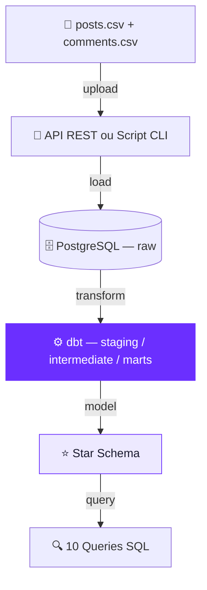

# 🏟️ Desafio de Engenharia de Dados

> **RETIZE SPORTS MEDIA NETWORK** · Social Media Analytics Case
>
> 📅 Prazo: 7 dias · 📬 Entrega: GitHub · 🌐 [retize.com.br](https://retize.com.br)

---

## 📖 O Contexto

Você acaba de ingressar no time de Engenharia de Dados da Retize. Nossos clientes publicam conteúdo em múltiplas plataformas de redes sociais e precisam entender seu desempenho de forma consolidada.

Extraímos uma amostra bruta desses dados em dois arquivos CSV. Sua missão é construir uma solução reproduzível de ponta a ponta: da ingestão desses dados até a criação de um modelo analítico em **star schema** capaz de responder a perguntas de negócio sobre alcance, engajamento e sentimento de comentários.

---

## 🗂️ Os Dados Fornecidos

Os arquivos serão fornecidos junto ao envio deste desafio:

| Arquivo | Descrição |
|---|---|
| `posts.csv` | Postagens de redes sociais com métricas de alcance e engajamento |
| `comments.csv` | Comentários enriquecidos com análise de sentimento |

> **Atenção:** espere encontrar atritos do mundo real. Formatos de data podem divergir, algumas linhas podem estar sujas e tipos de mídia variam por plataforma.

---

## 🏗️ Arquitetura Esperada

---

## 🛠️ Escopo Esperado

### Parte 1 — Ingestão dos Dados

Desenvolva uma forma reproduzível de receber e carregar os arquivos CSV no banco de dados. A ingestão pode ser feita por meio de uma **API simples** ou um **script/CLI bem documentado**.

**Requisitos obrigatórios:**

- A solução deve permitir o carregamento dos dois arquivos CSV
- Os dados devem ser carregados em tabelas iniciais no banco escolhido
- A execução deve estar documentada de forma clara
- A ingestão deve informar sucesso ou erro durante a execução

**Observações:**

- Não é necessário criar endpoints para consultas analíticas
- As respostas analíticas serão entregues como arquivos `.sql` no repositório
- Disponibilizar a ingestão por meio de uma API será considerado um diferencial

---

### Parte 2 — Modelagem e Transformação

Após a ingestão, os dados devem ser transformados com **dbt** (ou ferramenta similar) até chegarem a um modelo dimensional em **star schema**.

Os dados devem ser criados em um banco relacional local. Você pode utilizar **PostgreSQL** ou **SQLite**, desde que documente sua escolha. PostgreSQL será considerado a opção preferencial por aderência ao contexto do desafio.

**Esperado nesta etapa:**

- Definição clara da granularidade das tabelas
- Separação coerente entre fatos e dimensões
- Relacionamento consistente entre postagens e comentários
- Organização da transformação em etapas compreensíveis
- Estrutura final adequada para responder às perguntas de negócio

**Boas práticas esperadas:**

- Camadas organizadas — por exemplo: `raw`, `staging`, `intermediate` e `marts`
- Nomenclatura consistente
- Tratamento de tipos de dados
- Cuidado com chaves e relacionamentos
- Documentação mínima dos modelos
- Testes de qualidade, quando fizer sentido

---

## ❓ Perguntas de Negócio

Sua solução deve permitir responder obrigatoriamente às 10 perguntas abaixo com queries SQL:

| # | Pergunta |
|---|---|
| 1 | Qual foi a quantidade total de postagens por plataforma ao longo do período analisado? |
| 2 | Qual foi a quantidade total de postagens por tipo de mídia e por plataforma? |
| 3 | Quais foram os 10 posts com maior alcance no período? |
| 4 | Quais foram os 10 posts com maior taxa de engajamento no período? |
| 5 | Como o volume de comentários evoluiu ao longo do tempo por plataforma? |
| 6 | Quais tipos de mídia apresentaram melhor desempenho médio em alcance, curtidas, comentários e compartilhamentos? |
| 7 | Quais posts concentraram maior volume de comentários e como isso se compara com seu alcance e engajamento? |
| 8 | Existe diferença de desempenho por dia da semana e por horário de publicação, considerando alcance, engajamento e comentários? |
| 9 | Quais contas e posts tiveram maior negatividade de comentários? |
| 10 | Quais formatos e tipos de mídia (imagem ou vídeo) possuem maiores índices de positividade ou negatividade em seus comentários? |

---

## 📦 Entregáveis Obrigatórios

### 1. Repositório no GitHub
Repositório público com todo o código da solução.

### 2. README
O repositório deve explicar de forma objetiva:

- Visão geral da solução
- Arquitetura proposta
- Como subir o ambiente
- Como executar a ingestão
- Como rodar as transformações
- Como executar as queries
- Decisões técnicas principais
- Limitações ou melhorias futuras

### 3. Modelagem de Dados
Inclua um diagrama ou representação do modelo proposto, contendo:

- Tabelas principais
- Chaves e relacionamentos
- Granularidade esperada

Pode ser MER, diagrama dimensional ou ambos.

### 4. Projeto dbt (ou equivalente)
Com os modelos e transformações usados para levar os dados brutos até o schema analítico final.

### 5. Queries Analíticas
Arquivos `.sql` respondendo às 10 perguntas de negócio.

### 6. Documentação da API
Pode ser no README, collection do Postman ou documentação em Markdown.

---

## 🏆 Critérios de Avaliação

**O que vamos avaliar:**

- Qualidade da modelagem de dados e coerência do modelo analítico proposto
- Organização da camada de transformação com dbt ou ferramenta similar
- Qualidade da ingestão e da estrutura técnica da solução
- Capacidade de responder corretamente às perguntas de negócio com SQL
- Clareza da documentação e reprodutibilidade do projeto

**Diferenciais (bonus points):**

- 🐳 Docker Compose com toda a stack subindo com um único comando
- 🚀 Deploy da aplicação ou parte da solução (Render, Railway, Fly.io etc.)
- ✅ Validações adicionais de qualidade de dados além dos testes padrão do dbt
- 📋 Logging estruturado e instruções claras de troubleshooting
- ⚡ Experiência de execução simples e reproduzível

---

## 🤖 Política de Uso de Inteligência Artificial

O uso de ferramentas de IA **é permitido** neste desafio.

**Uso recomendado:**
- Apoio para debugging
- Revisão de código
- Esclarecimento de conceitos técnicos
- Apoio na escrita de documentação
- Geração de dados mockados ou exemplos locais

**Uso não recomendado:**
- Delegar à IA a construção integral da solução
- Copiar código sem revisar, adaptar e compreender
- Entregar decisões técnicas que você não consiga justificar

> **Transparência:** se você usar IA de forma relevante, inclua no README um pequeno resumo explicando como ela foi utilizada. Não é obrigatório, mas será visto de forma positiva.

A solução entregue deve refletir sua capacidade de engenharia e tomada de decisão. Durante a conversa sobre o desafio, esperamos que você consiga explicar e defender as escolhas feitas.

---

## ⏱️ Prazo de Entrega

**1 semana** a partir do recebimento oficial do desafio.

## 📬 Forma de Envio

- Repositório **público** no GitHub
- Envio do link para **desafios.tech@retize.com.br**

---

## 🧭 Orientações Finais

Busque uma solução clara, organizada e reproduzível.

Se precisar assumir simplificações, documente essas escolhas no repositório. Também é válido registrar melhorias que você implementaria em uma próxima versão.

Boa sorte! 🚀

---

*© 2026 Retize Sports Media Network · [retize.com.br](https://retize.com.br)*
